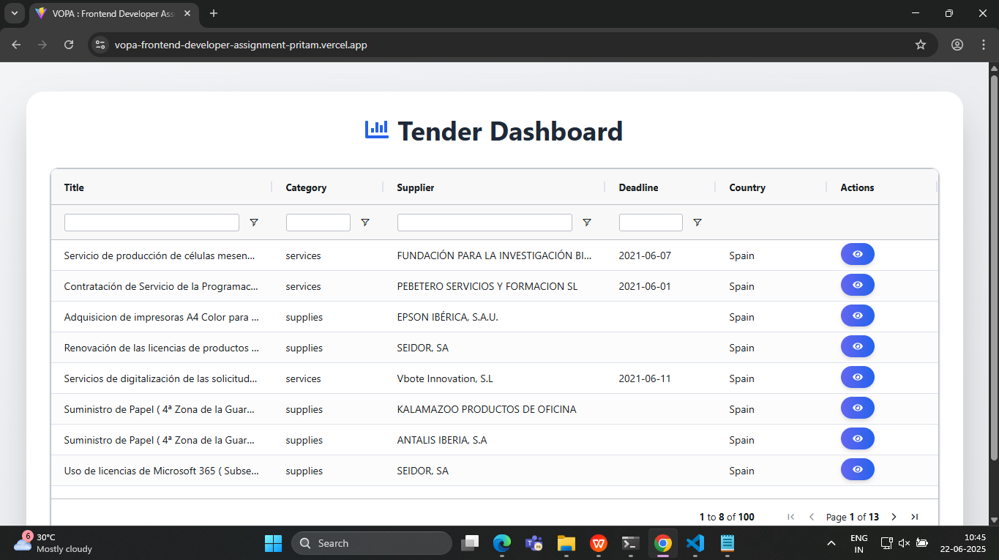
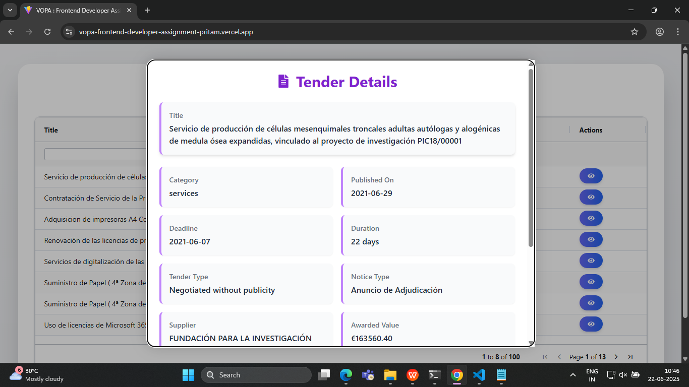

# 🇪🇸 Spain Tenders Visualization - VOPA Frontend Developer Assignment

This project is a creative visualization of tender data for companies operating in Spain. It fetches and displays real-time tender information using a visually engaging table and modal interface, built with **React** and **AG Grid**.

---

## 🚀 Features

- Fetch and display tender listings with meaningful columns
- Interactive table powered by AG Grid
- Click on any row to view detailed tender information
- Clean, responsive UI with informative layout

---

## 🛠️ Tech Stack

- **React (JS/TS)**
- **AG Grid** for data visualization
- **Tailwind CSS** for styling
- **Vite** for development and build tooling

---

## 📦 Installation & Running Locally

1. Clone the repository:

   ```bash
   git clone https://github.com/pritam-bhalnor/VOPA-Frontend-Developer-Assignment.git
   cd VOPA-Frontend-Developer-Assignment
   ```

2. Install dependencies:

   ```bash
   yarn install
   ```

3. Run the development server:

   ```bash
   yarn dev
   ```

---

## 🌐 Production URL

> ⚠️ **CORS Warning**: To avoid CORS issues with the public API during development, please disable browser security using the instructions below.

You can explore the deployed app here:

👉 **[Live Demo](https://vopa-frontend-developer-assignment-pritam.vercel.app/)**

---

## 🛡️ Disable CORS for Production Testing

### 🪟 Windows

```bash
# Open CMD or PowerShell in the folder where chrome.exe is located:
.\chrome.exe --user-data-dir="C://chrome-dev-disabled-security" --disable-web-security --disable-site-isolation-trials
```

### 🍎 macOS

```bash
open /Applications/Google\ Chrome.app --args --user-data-dir="/var/tmp/chrome-dev-disabled-security" --disable-web-security --disable-site-isolation-trials
```

### 🐧 Linux

```bash
google-chrome --user-data-dir="~/chrome-dev-disabled-security" --disable-web-security --disable-site-isolation-trials
```

🔗 Reference: [Disable CORS in Browser](https://simplelocalize.io/blog/posts/what-is-cors/#3-disable-browser-cors-checks)

---

## 🖼️ Screenshots

### 📊 Tender Table View

*A clean and sortable table of Spain’s latest tenders with key details.*



### 🔍 Tender Detail Modal

*Detailed view of selected tender displayed in a modal.*



---

## 👤 Author

**Pritam Bhalnor**  
[LinkedIn](https://www.linkedin.com/in/pritam-bhalnor-a00985343/) • [GitHub](https://github.com/pritam-bhalnor)
