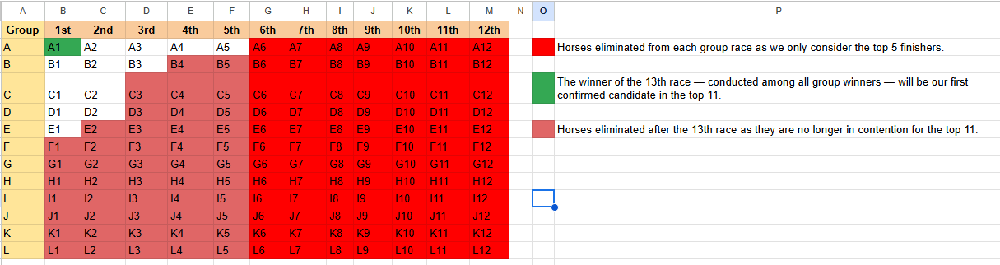

# 🐎 Logic Puzzle Solution: Find the Top 11 Fastest Horses Among 144

This solution outlines the step-by-step strategy to determine the **top 11 fastest horses** out of 144, under the constraint that only 12 horses can race at a time, and **no stopwatch** is allowed — only race order is known.

---

## ✅ Problem Constraints

- 144 horses total.
- Only 12 horses can race at once.
- You can only see the **relative finishing order**, not exact times.
- Objective: Find the **top 11 fastest horses** using the **minimum number of races**.

---

## 🧠 Steps to Solve

### 1. Group Division and Initial Races (12 Races)

Divide the 144 horses into **12 groups** (A to L), with **12 horses in each group**.

➡️ Conduct **12 separate races**, one for each group, to determine the relative order within each group.

---

### 2. Determine the Fastest Horse (13th Race)

Conduct a **13th race** with the **winners of each group** — i.e., A1, B1, ..., L1 (12 horses total).

➡️ This race identifies the **fastest horse overall** and helps determine the strongest groups.  
➡️ You can now **eliminate many horses** that mathematically cannot make it into the top 11.

---

### 3. Final Selection Race (14th Race)

Select **12 horses** that are still in contention based on earlier results. These may include:

- 2nd and 3rd place from the group of the 13th race winner.
- 2nd and 3rd place from groups whose winners finished 2nd and 3rd in the 13th race.
- Other close contenders.

➡️ Run the **14th race** with these 12 horses.  
➡️ Pick the **top 10 finishers** from this race.

---

## 🏁 Final Result

- The **winner of the 13th race** is the **fastest horse (Rank 1)**.
- The **top 10 horses from the 14th race** fill positions **2 to 11**.

✅ **Total Races Required: 14**

---

## 📌 Summary

| Step | Description                      | Races Used |
|------|----------------------------------|------------|
| 1    | Group and race 144 horses        | 12         |
| 2    | Race among group winners         | 1          |
| 3    | Final race to pick top contenders| 1          |
|      | **Total**                        | **14**     |

---

## 📊 Race Grouping Visualization

https://docs.google.com/spreadsheets/d/1IvydFk8obSs0h7nWuwgn_HFPo5KfhAJq5FJewTpV-mU/edit?usp=sharing
